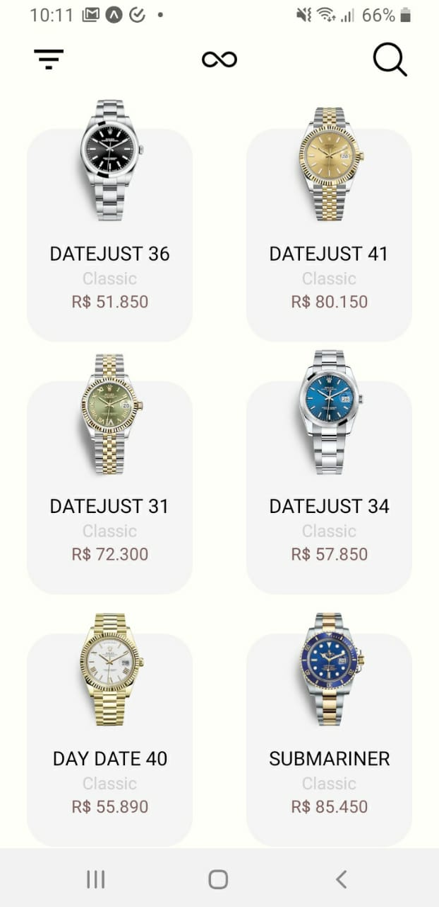
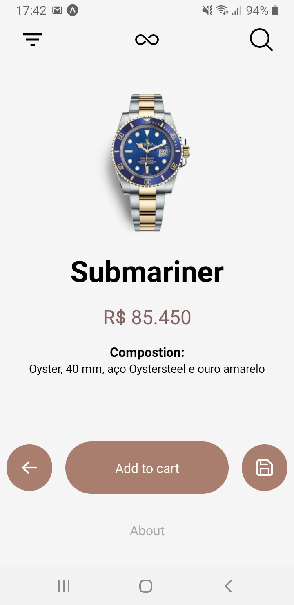

<h1 align="center">WatchShop</h1>
<p align="center">
  A simple but well looking(or at least it was supposed to be) watch store for mobile
</p>

---

<table style="width:100%">
  <tr>
   <td align="center">
   <h5>Sample screen</h3>

   <td align="center">
   <h5>Buying screen</h3>
  </tr>
</table>

# :computer: Technologies

This project was built using the follow technologies:

- [React-Native](https://reactnative.dev/)
- [Expo](https://expo.io/)
- [Express](https://expressjs.com/)
- [Nodejs](https://nodejs.org/en/)

---

# :construction_worker: How to run

```bash
# Clone Repository
$ git clone https://github.com/hercules-sousa/watchDesign.git
```

### 📦 Run API

```bash
# Go to server folder
$ cd watchDesign/server

# Install Dependencies
$ yarn install

# Run Aplication
$ yarn start
```

Access API at http://localhost:3333/ or if you wish you can set an environment PORT variable.

### 📱 Run Mobile Project

To run the mobile project you need a cellphone with [expo](https://play.google.com/store/apps/details?id=host.exp.exponent) app installed or a emulator android/ios.
<br />
You should fork this repository to your machine. Then, inside of the project's folder run the following commands:

```bash
# Go to mobile folder
$ cd watchDesign/mobile

# Install Dependencies
$ yarn install

# Run Aplication
$ yarn start
```

Afterwards, read the QRCode with [expo](https://play.google.com/store/apps/details?id=host.exp.exponent) app or run on an emulator.
